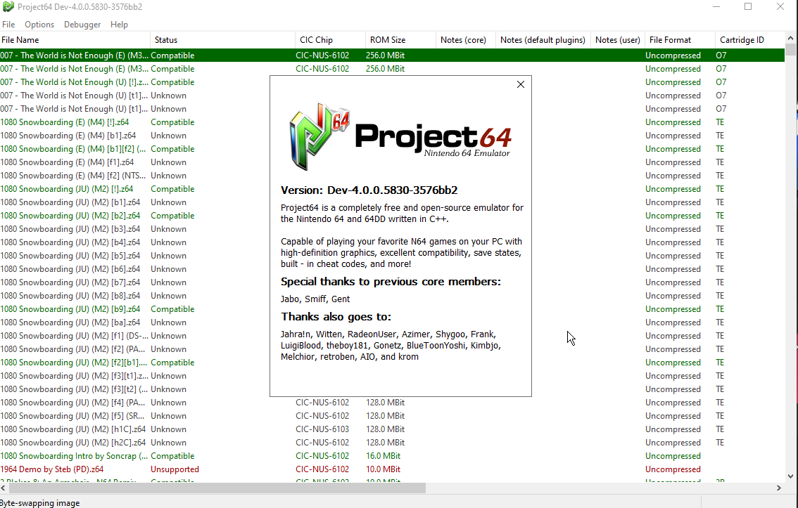

# pj64_megaton — Project64 for Megaton Hammer

> **A fork of [Project64](https://github.com/project64/project64) (GPLv2) customised as the vanilla-Nintendo-64
> play-test target for the [Megaton Hammer](https://github.com/AgitationSkeleton/MegatonHammer_Public) Zelda 64
> level editor.** All original Project64 behaviour is unchanged; the only addition is a small per-frame hook
> that lets the editor boot straight into a level it injected into an OoT ROM. Upstream's own README follows
> below the divider.

## What it is

Megaton Hammer compiles a level to several play-test targets: Ship of Harkinian (OoT) and 2Ship (MM) for the
Harkinian PC ports, and **this Project64 fork for the vanilla Nintendo 64 path**. The editor injects the level
as a new (or replacement) scene into an OoT MQ debug ROM (`gc-eu-mq-dbg`) and launches this build, which warps
the game to that scene automatically — so you can play-test on an accurate N64 emulator, not only the PC ports.

## How it works

The entire change is one added translation unit — `Source/Project64-core/N64System/MegatonHammer.cpp` — plus a
one-line call from `N64System.cpp`'s per-frame refresh:

- **Auto-warp.** Each frame the hook reads `%TEMP%\MegatonHammer\mh_n64_playtest.txt` (written by the editor's
  `Project64Playtest.cs`), scans RDRAM for the live OoT `PlayState` (the GameState whose `init` field is
  `Play_Init`), validates the neighbouring `main`/`destroy`/`gfxCtx` pointers, then pokes `nextEntranceIndex` +
  `transitionTrigger` (`TRANS_TRIGGER_START`) and `gSaveContext.save.linkAge` — the same fields the game's own
  area exits set. It fires once, and only when `gameMode` reads a valid 0..3, so a non-matching ROM is never
  poked.
- **Debug-ROM detection** by internal name ("THE LEGEND OF **DEBUG**").
- **Headless diagnosis.** An unconditional liveness heartbeat (frame + live CPU program counter) logs every 30
  frames, `MH_HEADLESS` skips the GFX `UpdateScreen`, and `MH_MAXFRAMES` self-terminates the run (`_exit(0)`)
  so a headless boot needs no external timeout-kill. State is logged to
  `%TEMP%\MegatonHammer\mh_n64_playtest.log`.

## Building

A standard Project64 build: `msbuild Project64.sln /p:Configuration=Release /p:Platform=x64`. Megaton Hammer's
release CI builds this fork and publishes `pj64-win-x64.zip`, which the editor downloads and installs on first
run — an end-user only needs the Megaton Hammer editor exe.

---

  

# Project64

Project64 is a free and open-source emulator for the Nintendo 64 and Nintendo 64 Disk Drive written in C++ currently only for Windows (planned support for other platforms in the future).

  * [Features](#features)
  * [Screenshot](#screenshot)
  * [Installation](#installation)
  * [Supported requirements](#supported-requirements)
  * [Support](#support)
  * [Changelog](#changelog)
  * [Dependencies](#dependencies)
  * [Contributing](#contributing)
  * [Maintainers and contributors](#maintainers-and-contributors)
  * [Links](#links)
  * [License](#license)

## Features

- Development and debugging tools
- Save/load states
- Fullscreen
- Controller support
- Great language support
- Support for many popular N64 emulator plugins

## Screenshot

  

## Installation

Installer for the latest stable releases are available [here](https://www.pj64-emu.com/windows-downloads).

Download nightly builds [here](https://www.pj64-emu.com/nightly-builds).

AppVeyor (Windows x86/x64): 

*Side note: 64-bit builds are considered experimental and aren't currently supported*

## Supported requirements

* Operating system
  * 64-bit Windows 10 and 11
* CPU
  * 1GHz or faster Intel or AMD processor with at least SSE2 support
* RAM
  * 2GB or more
* Graphics card
  * DirectX 8 capable (Jabo's Direct3D8)
  * OpenGL 3.3 capable (Project64 Video)
  * OpenGL 3.3 capable (GLideN64)
  * OpenGL 3.3 capable (Angrylion's RDP Plus)
  * Vulkan 1.1 capable (Parallel-RDP)

Intel integrated graphics can have issues that are not present with Nvidia and AMD GPU's even when the requirements are met. Outdated drivers can also cause issues, so please update them!

## Support

For support, we ask all users read our [support document](./Docs/SUPPORT.md). Read this ***before*** opening issues.

Please join our [Discord server](https://discord.gg/Cg3zquF) for support, questions, etc.

## Changelog

If you would like to see a changelog that is available [here](./Docs/CHANGELOG.md).

## Dependencies

- [Duktape](https://duktape.org/): MIT license
- [7-Zip](https://7-zip.org/): LGPL+unRAR license
- [zlib](https://zlib.net/): zlib license
- [libpng](http://libpng.org/pub/png/libpng.html): libpng license
- [discord-rpc](https://github.com/discord/discord-rpc): MIT license
- DirectX: Copyright (C) Microsoft
- [Windows Template Library](https://wtl.sourceforge.io/): Common Public License

## Contributing

Contributions are always welcome!

If you want to contribute to this project, please click [here](https://github.com/project64/project64/blob/develop/Docs/BUILDING.md) to get more information on how to set up a local build environment.

See the [contributing](./.github/CONTRIBUTING.md) file for ways to get started.

## Maintainers and contributors

- [@Project64](https://www.github.com/project64) - Zilmar - current maintainer
- Jabo - Previous contributor
- Smiff - Previous contributor
- Gent - Previous contributor

Also see the list of [community contributors](https://github.com/project64/project64/contributors).

## Links
- [Website](https://pj64-emu.com)
- [Discord](https://discord.gg/Cg3zquF)

## License

Please see the [license](./license.md) for more details.
